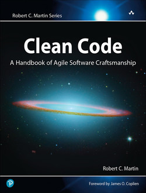

# Clean Code: A Handbook of Agile Software Craftsmanship by Robert C. Martin

## Chapter One: Clean Code

* Clean code does one thing well.
* One broken window starts the process toward decay.
* Clean code reads like well-written prose.
* Code without tests, is not clean.
* Clean code can be read, and enhanced by a developer other than its original author.
* Clean code always looks like it was written by someone who cares.
* Clean code contains no duplication, is expressive, and has tiny abstractions.
* Leave the campground cleaner than you found it.

## Chapter Two: Meaningful Names

* Use intention-revealing names.
* Avoid disinformation.
* Make meaningful distinctions.
* Use pronounceable names.
* Use searchable names.
* The length of a name should correspond to the size of its scope.
* Avoid encodings.
* Avoid mental mapping.
* Classes and objects should have noun or noun phrase names like `Customer`, `WikiPage`, `Account`, or `AddressParser`.
* Methods should have verb or verb phrase names like `postPayment`, `deletePage`, or `save`.
* Don't be cute. Say what you mean. Mean what you say.
* Pick one word per concept.
* Don't pun.
* Use solution domain names.
* Use problem domain names.
* Add meaningful context.
* Don't add gratuitous context.

## Chapter Three: Functions

* Functions should be small.
* Indent level of a function should not be greater than one or two.
* Functions should do one thing. They should do it well. They should do it only.
* Functions that do one thing cannot be reasonably divided up into sections.
* One level of abstraction per function.
* Code should read top-down like a narrative.
* Bury switch statements away, for example, in abstract factories.
* Use descriptive names.
* Zero is the ideal number of arguments. Followed by one and two. Avoid three or more.
* Avoid adding output information to arguments.
* Avoid flag arguments.
* Create argument objects.
* Have no side effects.
* Prefer exceptions to returning error codes.
* Extract try/catch blocks.
* Don't repeat yourself.
* Functions don't come out this way at the start. We massage them after a rough draft.

## Chapter Four: Comments

* Comments do not make up for bad code.
* Explain yourself in code.
* Good comments include: legal comments, informative comments, explanations of intent, clarifications,
warnings of consequences, TODO comments, amplifications, and docs in public APIS.
* Bad comments include: mumbling, redundant comments, misleading comments, mandated comments, journal
comments,
