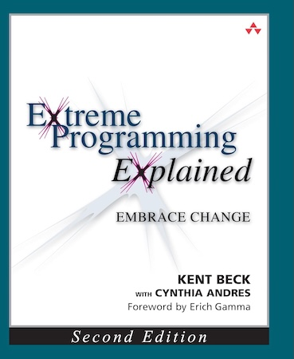

# Extreme Programming Explained: Embrace Change by Kent Beck

## Chapter 1: What is XP?

Extreme Programming (XP) is a style of programming that includes techniques and principles to deliver
better quality software. It includes techniques such as small iterations, short cycles, fast feedback,
and the ability to adapt to changing requirements

## Section 1: Exploring XP

### Chapter 2: Learning to Drive

Driving isn't a case of going in a straight line. It's about being constantly aware and making small
adjustments. This is fundamental to XP.

### Chapter 3: Values, Principles, and Practices

Values are the root of things we like and don't like in a situation. Practices are evidence of values.
Practices are clear. Practices bring accountability to values. Because values and practices are an ocean
apart i.e. values should be the same regardless of situation but practices may not, we need to bridge
them via principles. Principles are domain-specific guidelines for life.

### Chapter 4: Values

XP embraces five values to guide development:

* Communication - this is the most important
* Simplicity - strive to eliminate wasted complexity
* Feedback - change is inevitable, change requires feedback
* Courage
* Respect

### Chapter 5: Principles

Principles that guide XP:

* Humanity - understand that people develop software
* Economics - ensuring what you're doing has business value
* Mutual Benefit - every activity should benefit all concerned
* Self-Similarity - try copying the structure of one solution into a new context
* Improvement - there is no perfect process (adjective) but you can perfect your process (verb)
* Diversity - teams need to bring together a variety of skills
* Reflection - good teams think about how and why they are working
* Flow - delivering a steady flow of valuable software
* Opportunity - learn to see problems as opportunities for change
* Redundancy - stop defects using multiple practices e.g. pair programming, continuous integration, daily deployments
* Failure - failure imparts knowledge
* Quality - pushing quality higher often results in faster delivery
* Baby Steps - momentous change taken all at once is dangerous
* Accepted Responsibility - it cannot be assigned, it can only be accepted

### Chapter 6: Practices

Practices themselves are barren unless given purpose by values.

### Chapter 7: Primary Practices

* Sit Together - opens up communication
* Whole Team - people need a sense of "team", include people with all the skills needed to succeed, avoid splitting across multiple teams
* Informative Workspace - people going into the workspace should be able to see how a project is going in fifteen seconds i.e. story cards on a wall
* Energized Work - work only as many hours as you can be productive
* Pair Programming - write all production programs with two people sitting at one machine (DON'T AGREE WITH THIS)
* Stories - plan using units of customer-visible functionality
* Weekly Cycle - plan work a week at a time
* Quarterly Cycle - plan work a quarter at a time
* Slack - don't overcommit, give yourself slack to deliver to commitments
* Ten-Minute Build - automatically build the system and run tests in ten minutes
* Continuous Integration - integrate and test changes after no more than a couple of hours
* Test-First Programming - write a failing automated test before changing any code
* Incremental Design - invest in the design of the system every day

### Chapter 8: Getting Started

Start by changing one thing at a time. Start by changing yourself. Dictating practices
to a team harbours resentment and mistrust. Map practices with your team to identify
what that practice means to you and signs that it isn't going well. Don't let it be a
complaining session. Look for ways to find solutions.

### Chapter 9: Corollary Practices

Look at implementing the primary practices before these.

* Real Customer Involvement - make people whose lives and business affected by your system part of the team
* Incremental Deployment - deploy the smallest piece of functionality you can, avoid "big bang"
* Team Continuity - keep effective teams together
* Shrinking Teams - as a team grows in capability, keep its workload constant but gradually reduce its size
* Root-Cause Analysis - when a defect is found, eliminate it and its cause
* Shared Code - anyone on the team can improve any part of the system at any time
* Code and Tests - maintain only the code and the tests as permanent artifacts, generate documents from these
* Single Code Base - don't have multiple versions of the same code (i.e. different branches long-lived)
* Daily Deployment - put new software into production every night
* Negotiated Scope Contract - write contracts for software development that are small and precise
* Pay-Per-Use - charge for every time the system is used

### Chapter 10: The Whole XP Team

Here are the various roles of an XP team:

* Testers - they are involved early in the cycle, implementing tests that must pass before a feature is released
* Interaction Designers - choose metaphors for the system, write stores, and evaluate the system to find opportunities for new stories
* Architects - look for large scale changes and architect the system
* Project Managers - facilitate communication inside and outside the team
* Product Managers - write stories, pick themes, and help define priorities
* Executives - provide the team with courage, confidence, and accountability
* Technical Writers - ensure documentation is up-to-date, quick, and easy to maintain
* Users - help write and pick stories from experience with the system
* Programmers - actually write the code to implement features
* Human Resources - deal with hiring and performance reviews

People may fulfil multiple roles or even switch roles, it's not set in stone.

### Chapter 11: The Theory of Constraints

The theory of constraints suggests that regardless of process, there is always a bottleneck. Once that bottleneck
is moved, another bottleneck will be identified. Work on identifying these bottlenecks and places that you can
improve efficiency regularly.

### Chapter 12: Planning: Managing Scope

Planning makes goals and directions clear and explicit. Plan as close as you can to implementation. That way, you
have the most up-to-date information at the time. Plans change, be prepared to adapt. Work on estimations. This
will improve with experience and how much time you've spent on similar tasks. Prefer using time estimates than
story points or t-shirt sizes.

### Chapter 13: Testing: Early, Often, and Automated

Defects destroy trust across the board. From customers through to developers. Testing early, whilst programming
reduces defects and reduces the cost of defects. Trying to fix a defect when it has been discovered years later
is expensive. Testing early gives us confidence in what we build.

### Chapter 14: Designing: The Value of Time

Design just enough and incrementally. As you get more experience, you can make more informed design decisions.
Doing everything up front is asking for trouble. Strive for simplicity in your designs.

### Chapter 15: Scaling XP

* Try and solve problems with a small team first. If it doesn't, begin with a small team, then split it amongst autonomous teams.
* Don't force XP on the entire organisation. You can fit your team's new ways of working into this.
* Strive for simplicity. Make improvements as you go along whilst delivering new functionality.
* XP principles do scale. Practices may require some adjustment.

### Chapter 16: Interview

Interview with a Senior Vice President of an airline and the benefits and challenges of implementing XP in the company.

## Section 2: Philosophy of XP

### Chapter 17: Creation Story

TODO
