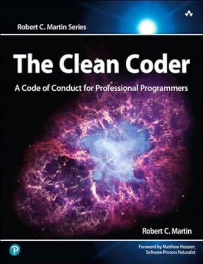

# The Clean Coder: A Code of Conduct for Professional Programmers by Robert C. Martin

## Chapter One: Professionalism

* Take responsibility
* Do no harm to function
  * QA should find nothing
  * You must know it works
  * Automated QA
* Do no harm to structure
* Work ethic
  * Know your field
  * Continuous learning
  * Practice
  * Collaboration
  * Mentoring
  * Know your domain
  * Identify with your employer/customer
  * Humility
