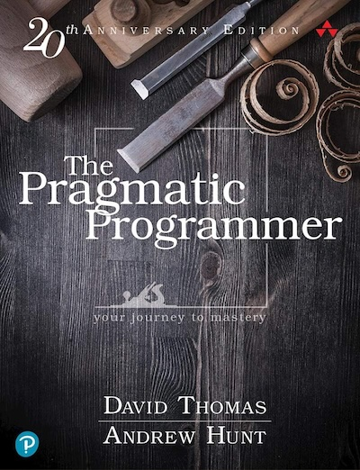

# The Pragmatic Programmer by David Thomas and Andrew Hunt

## Chapter One: A Pragmatic Philosophy

* It's your life, you have agency
* Make changes in your job or change your job
* Take responsibility, provide options, don't make lame excuses
* Don't live with broken windows
* Be a catalyst for change
* Remember the big picture
* Make quality a requirements issue
* Invest regularly in your knowledge portfolio
  * Learn at least one new language every year
  * Read a technical book each month
  * Read non-technical books too
  * Take classes
  * Participate in local users groups and meet-ups
  * Experiment with different environments
  * Stay current
* Critically analyse what you read and hear
* Communication:
  * English is just another programming language
  * Know your audience
  * Know what you want to say
  * Choose your moment, make what you're saying relevant in time
  * Choose a style to suit your audience
  * Make it look good
  * Involve your audience
  * Be a listener
  * Get back to people
  * Build documentation in, don't bolt it on
