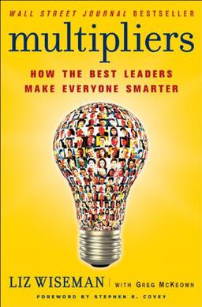

# Multipliers: How the Best Leaders Make Everyone Smarter by Liz Wiseman

## Chapter One: The Multiplier Effect

* Multipliers are leaders who elevate those around them, they bring out the best in them
* Diminishers are leaders who don't get the best out of people, often bringing them down
* Multipliers are genius makers
* Under Diminishers, people feel underutilised
* Multipliers get the most out of people
* Diminishers see themselves as being intellectually superior
* Multipliers see the intelligence in others
* The five disciplines of the Multiplier:
  * Attracting and optimising talent
  * Creating intensity that requires best thinking
  * Extending challenges
  * Debating decisions
  * Instilling ownership and accountability
* Multipliers have a hard-edge, they expect a lot from people
* Multipliers don't play small, they play big and invite others to do so
* Multipliers have a sense of humour and can see the light in things
* People can accidentally become Diminishers
* There is a spectrum from Multiplier to Diminisher that we can fall on

## Chapter Two: The Talent Magnet

* Empire Builders hoard resources and underutilise talent
* Talent Magnets attract talented people and get the best out of them
* The four practices of the Talent Magnet:
  * Look for talent everywhere
  * Find people's native genius
  * Utilise people at their fullest
  * Remove the blockers
* Becoming a Talent Magnet:
  * Identify the genius
  * Give them a challenge
  * Let superstars go, don't hold them back

## Chapter Three: The Liberator

* Tyrants create tense environments and supress people's thinking
* Liberators create intense environments that require people's best thinking and work
* Three practices of the Liberator:
  * They create space (they listen, they release others by restraining themselves)
  * They demand best work
  * They generate rapid learning cycles (they share their own mistakes and insist that other's learn from theirs)
* Becoming a Liberator:
  * Play fewer chips, talk less
  * Label your opinions as hard or soft
  * Talk up your mistakes
  * Make space for mistakes

## Chapter Four: The Challenger

* Know-It-Alls give directives to show how much they know
* Challengers define opportunities that challenge people to go beyond what they know
* The three practices of the Challenger:
  * Seed the opportunity (creating starting points, challenge assumptions, reframe problems)
  * Lay down a challenge (let others fill in the blanks)
  * Generate belief in what is possible (orchestrate an early win)
* Become a Challenger by:
  * Only asking questions (sometimes)
  * Creating a stretch challenge
  * Going on a bus trip (taking the team to see customers using the product for example)
  * Take a massive baby step (get all of the company making a small improvement)

## Chapter Five: The Debate Maker

* Decision Makers decide efficiently with a small inner circle and leave people in the dark
* Debate Makers engage people in decisions up-front
* The three practices of the Debate Maker:
  * Frame the issue (define the question, form the team, assemble the data, frame the decision)
  * Spark the debate
  * Drive a sound decision (communicate the decision)
* Make a debate by:
  * Asking the hard question
  * Asking for evidence
  * Asking everyone
  * Asking people to switch (arguing for and against)

## Chapter Six: The Investor

* Micromanagers manage every detail in a way that creates a dependence on the leader
* Investors give responsbility and ownership to produce results independent of the leader
* The three practices of the Investor:
  * Define ownership
  * Invest resources (team and coach, provide backup)
  * Hold people accountable
* Becoming an Investor:
  * Give 51 percent of the vote
  * Let nature take its course
  * Ask for the F-I-X not the problem
  * Give it back (don't take back ownership)
