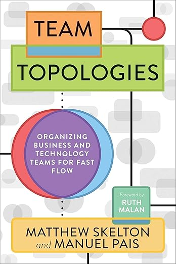
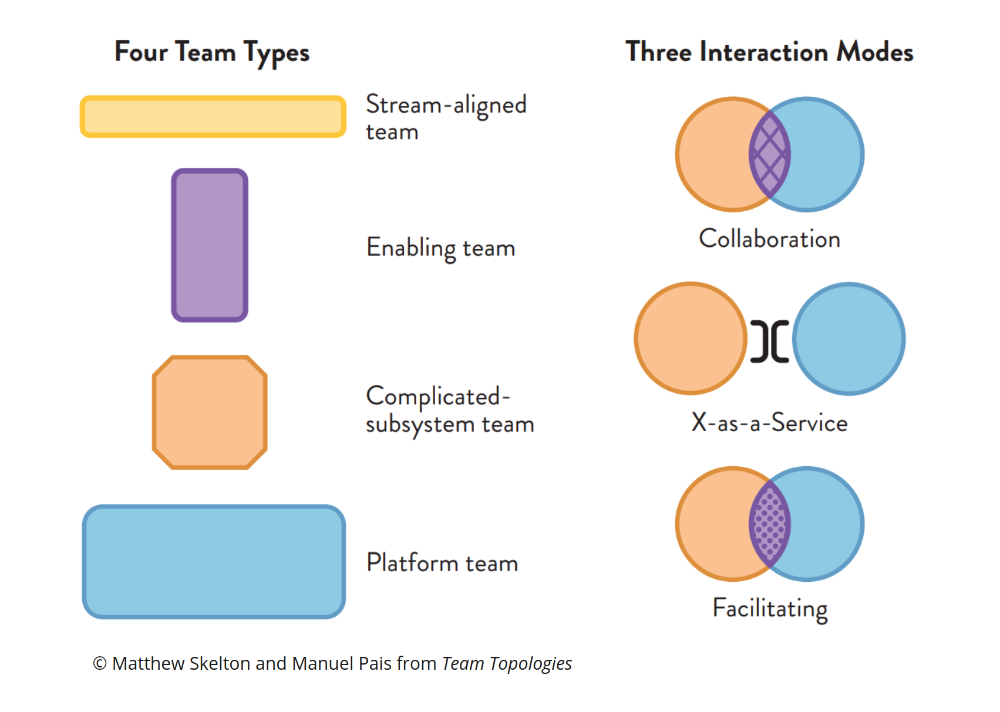

# Team Topologies: Organizing Business and Technology Teams for Fast Flow by Matthew Skelton and Manuel Pais

Conway's law states that: "Organizations which design systems...are constrained to produce designs which are
copies of the communication structures of these organizations." We can use this to our advantage by being
thoughtful with our team design and taking this as the first pass at technical architecture.

The majority of this book focuses on four team types and three interaction modes highlighted below.

## Four Team Types

### Stream-aligned Team

Aligned to a flow of work from (usually) a segment of the business domain.

### Enabling Team

Helps a Stream-aligned team to overcome obstacles. Also detects missing capabilities.

### Complicated-subsystem Team

Where significant mathematics/calculation/technical expertise is needed.

### Platform Team

A grouping of other team types that provide a compelling internal product to accelerate delivery by Stream-aligned
teams.

## Three Interaction Modes

### Collaboration

Working together for a defined period of time to discover new things (APIs, practices, technologies, etc.)

### X-as-a-Service

One team provides and one team consumes something “as a Service”

### Facilitating

One team helps and mentors another team
