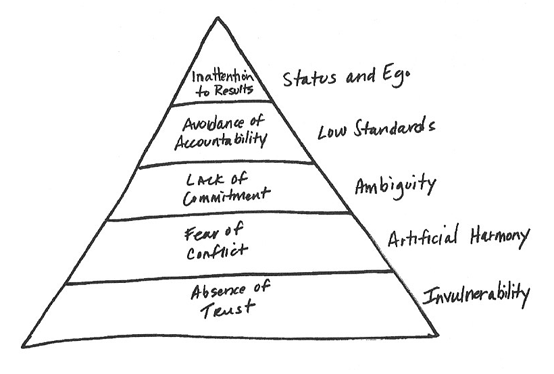

# The Five Dysfunctions of a Team: A Leadership Fable by Patrick Lencioni

## The Fable

### Part One: Underachievement

Kathryn is made CEO of DecisionTech. DecisionTech is a startup that was very successful in its first two years.
However, things quickly go sour. Deadlines are missed, key members of staff leave. Jeff, the founding CEO takes
a demotion and Kathryn is given the role, a surprise to many as she does not have a technical background or
experience running a company of this size.

Kathryn spends her first two weeks observing. The executive team start to question if it was a good idea to
hire her. She arranges an off-site for the executive team. Kathryn starts to realise that her executive team
have a lot of issues from behaviour and how they interact with each other.

### Part Two: Lighting the Fire

Martin, the Chief Technologist, sends out an email saying that he will be attending a sales meeting and missing
the start of the off-site. Kathryn confronts Martin, who's never really been confronted before, and says that he
can reschedule and that he will attend the off-site. Jeff speaks to Kathryn and says that he thinks the sales
meeting should go ahead. She firmly refuses. The chairman calls her later stating the same thing. She tells him
that she has been hired to fix the team and make them work together. She says things have to be broken in order
to fix them.

The off-site begins. Kathryn tells the group that serious change needs to happen and that may well involve people
leaving the team. She tells them that the team is dysfunctional. And from her experience, there are five
dysfunctions of a team. She begins with the first dysfunction: absence of trust. She tells the team how she has
observed their lack of trust, for example, lack of debate in meetings. She gets the team to open up about their
childhood to ease them into it. Throughout the day, they lightly rib each other and start to loosen up. All
except Mikey from marketing. She takes it very personally.

The next day, Kathryn asks the team to show vulnerability in order to build trust. Each of the team gives a
personal strength and weakness. Discussions break out after each one except Mikey's. She gives a very surface
level answer. She later calls Martin arrogant when he says his weakness is his people skills.
The room goes silent. Kathryn realises that Mikey's behaviour is having a huge impact on the team.

Kathryn changes direction and goes to the top of the triangle of the five dysfunctions, this time focussing
on: inattention to results. She highlights how dysfunctional teams do not care about the results of the
overall team and company. Individuals focus on their own performance and ego. She says that removing
high-performing individuals can be good for teams if they don't have the team's best interest in mind.
Arguments start to happen, particularly with Mikey. She states how well her department is performing even
though the company is failing.

The team ask Kathryn to go through the last three dysfunctions. The first one is fear of conflict which
is highlighted by artificial harmony. Harmony isn't necessarily a bad thing, but lack of conflict and
disagreement is. The second one is lack of commitment which is highlighted by ambiguity and no buy-in.
This is when team members feel like they aren't being heard. The final one is avoidance of accountability
which is highlighted by low standards. Mikey surprises Kathryn to say that this comes about because
the team hasn't bought in. Which means they let the standards slip and don't hold each other to account.

On the final day, Kathryn asks the group to come up with a single goal of success for the company until
the end of the year. A lot of debate and conflict happens until they finally agree that the goal is
to secure more customers before the end of the year. Kathryn even asks them to be precise and to put a
number on it. Everyone agrees that this has been the most productive they've been as a team. Someone
suggests that given the amount of work they need to do that they should cancel the next meeting and
off-site. Jeff pushes back on this and says that it would cause them to revert to form. Kathryn finishes
by saying that she will be ensuring there is debate, conflict, trust, and accountability over the coming
weeks. They leave the off-site.

### Part Three: Heavy Lifting

The team go back to work. Kathryn starts to see the progress they made deteriorating. She doesn't see
the team collaborating. In a staff meeting, Nick proposes an acquisition of another company. Kathryn
says they should not be doing it as it goes against their goal. Nick makes a comment about her lack
of experience and calls out Mikey who isn't present. They have a private conversation. Kathryn says
he should never make comments about staff who aren't present. They talk about how this is an ego
thing for Nick. He feels like he isn't contributing to the team and sees this as something to put on
his resume. Kathryn lays an ultimatum down: either leave or help the team. In a staff meeting later that
day, Nick apologises to Mikey and says that he isn't ready to quit yet. Kathryn announces that JR, head
of sales, has quit. Nick says he will fill in the role that has been left.

The team have a second off-site. During this, Kathryn asks for updates on their main goal from Nick.
Throughout the day, Mikey is dismissive and shows that she only cares about her own performance and
her team. Kathryn pulls her aside and says she thinks it best that Mikey leaves the company.
Mikey is upset and angry. After a bit of back and forth, she accepts that she should leave. Kathryn
tells the rest of the team when they reconvene, they look surprised. Some members even fear for
their jobs.

Over the coming weeks, Kathryn sees improvements. There is conflict but nobody questions the direction
she sets. She believes there is momentum.

### Part Four: Traction

Three months later at their third off-site, it's announced that the competitor they were considering
buying has actually made an offer to buy DecisionTech. They have been asked to make decision in the
executive group. Together, they firmly reject it. Over the course of the next year, DecisionTech
increases its sales, productivity, and staff retention. Jeff takes a step down and reports in to
Nick. Kathryn decides to reshape the board slightly as the company grows.

## The Model

1. Absence of trust. This stems from members being unwilling to be vulnerable with each other
2. This failure to trust each other sets the tone for the next dysfunction: fear of conflict.
3. A fear of conflict leads to lack of commitment. Because people haven't been able to air their
   opinion, then there'll be a struggle to get buy-in.
4. Because of this lack of commitment, this leads to avoidance of accountability. There isn't a
   clear plan, so even the best team members don't call each other out.
5. Inattention to results occurs when team members put their own individual needs before the team
   and aren't committed.

In simple terms, the best teams:

1. Trust each other.
2. Have healthy conflict and debates.
3. Have a clear plan.
4. Hold each other accountable.
5. They focus on the achievements of the collective.

### Understanding and Overcoming the Five Dysfunctions

#### Dysfunction 1: Absence of Trust

Trust takes time to build. And this isn't about past results and trusting that someone will deliver.
It's about allowing yourself to be vulnerable with people. To not guard yourself or act a certain way.
The team leader must show vulnerability themselves and not punish vulnerability. Several exercises can
be done to kick start this such as 360 feedback, telling the team about yourself, or even using
Myers-Briggs tests.

#### Dysfunction 2: Fear of Conflict

Conflict is productive. It saves time and gets to quick resolutions. The role of the leader should be to
allow these conflicts to happen and come to a healthy resolution. Have restraint and let it play out, the
team are adults, not children. Healthy conflict can be promoted using exercises such as promoting someone
to "mine" conflict, so to speak, and seek it out.

#### Dysfunction 3: Lack of Commitment

Clarity and decision-making are important. A decision is better than no decision at all, even if it turns
out to be the wrong one down the line. A leader must be willing to make decisions when a consensus isn't
met. Seeking consensus should not be the goal, giving everyone a voice and then getting buy-in is much
better. Seek to improve this by ensuring decisions from meetings are clarified with each other before
publicising. Other techniques such as making low-risk commitments to start with or setting deadlines
for when a decision should be make are a step forward.

#### Dysfunction 4: Avoidance of Accountability

Team members should hold each other accountable. It's heavy-handed but a fear of letting your teammates
down will encourage more accountability and better results. The role of the leader is not to carry this
on themselves. Every person in the team must be held accountable. This can be encouraged by clearly
displaying what is expected and what success looks like.

#### Dysfunction 5: Inattention to Results

Results and success of the team must be measured and rewarded versus the achievements of an individual.
Without this, the team is made up of individuals who may not behave in the best interests of the team.

Overall, mastering these simple behaviours will lead to high-functioning teams. At the core of these
behaviours, it simply boils down to allowing yourself to be human.
