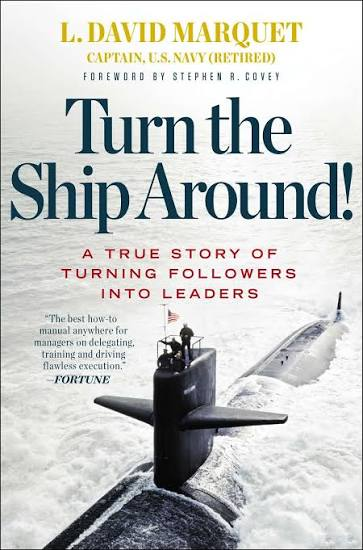

# Turn the Ship Around! A True Story of Turning Followers Into Leaders by L. David Marquet

## Control

* Find the genetic code for control and rewrite it.
* Act your way to new thinking.
* Short, early conversations make efficient work.
* Use "I intend to..." to turn passive followers into active leaders.
* Resist the urge to provide solutions.
* Eliminate top-down monitoring systems.
* Thinking out load (both superiors and subordinates).
* Embrace the inspectors.

## Competence

* Take deliberate action.
* We learn (everywhere, all the time).
* Don't brief, certify.
* Continually and consistently repeat the message.
* Specify goals, not methods.

## Clarity

* Achieve excellence, don't just avoid errors.
* Build trust and take care of your people.
* Use your legacy for inspiration.
* Use guiding principles for decision criteria.
* Use immediate recognition to reinforce desired behaviours.
* Begin with the end in mind.
* Encourage a questioning attitude over blind obedience.
