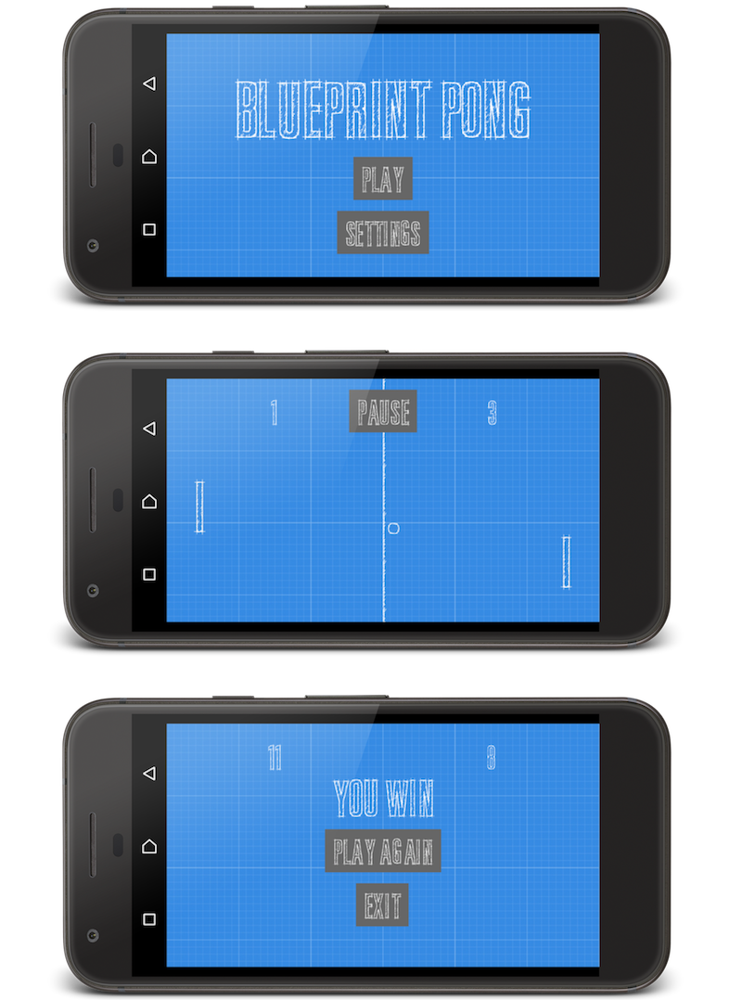

# Blueprint Pong

[](https://github.com/vanillaSlice/the-mono/actions?query=workflow%3ABlueprint%20Pong+branch%3Amain)
[](LICENSE)

A Pong clone built using [libGDX](https://libgdx.badlogicgames.com/).

## Screenshot



## Getting Started

### Prerequisites

* [Java 6+](https://www.oracle.com/technetwork/java/javase/overview/java8-2100321.html)
* [Gradle](https://gradle.org) (optional)

### Running

#### Desktop

From your terminal/command prompt run:

```
./gradlew desktop:run
```

This compiles the core and desktop project, and runs the desktop starter.

#### Android

From your terminal/command prompt run:

```
./gradlew android:installDebug android:run
```

This task will create a debug APK of the application, install it on the first connected emulator or device and start
the main activity.

## Instructions

You are the paddle on the left. On desktop, use arrow keys to move the paddle or click where you want the paddle to
move to. On Android devices, touch the screen where you want the paddle to move to. First player to 11 wins.

## Technology Used

For those of you that are interested, the technology used in this project includes:

* [libGDX](https://libgdx.badlogicgames.com/) (cross-platform game development framework)
* [Gradle](https://gradle.org) (for building and dependency management)

## Useful Links

Resources useful for the completion of this project:

* [Font](http://www.fontspace.com/kc-fonts/bluprint) (the font used in the game is Bluprint font created by KC Fonts)

## License

This project is licensed under the MIT License - see the [LICENSE](LICENSE) file for details.
