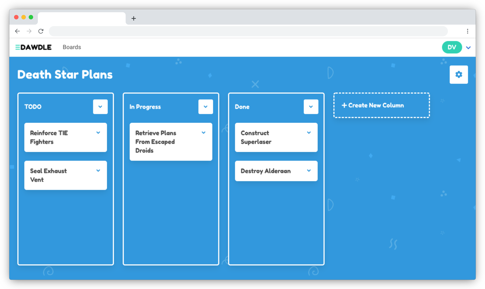

# Dawdle

[](https://github.com/vanillaSlice/dawdle/releases/latest)
[](https://github.com/vanillaSlice/dawdle/actions?query=workflow%3A%22Release%22+branch%3Amaster)
[](https://coveralls.io/github/vanillaSlice/dawdle?branch=master)
[](../LICENSE)

A project organisation tool built with [Flask](http://flask.pocoo.org/).
A deployed version can be viewed [here](https://dawdle.mikelowe.xyz/) (it's running on Heroku so may take a moment to
wake up).

## Screenshot



## Configuration

The following properties can be configured:

| Name                    | Purpose                                                          | Default               |
| ----------------------- | ---------------------------------------------------------------- | --------------------- |
| `CONTACT_EMAIL`         | The address to send contact emails to.                           | `None`                |
| `DEBUG`                 | If debug mode is enabled.                                        | `False`               |
| `ENV`                   | Environment the app is running in.                               | `production`          |
| `MAIL_DEFAULT_SENDER`   | The default address to send emails from.                         | `None`                |
| `MAIL_PASSWORD`         | The mail sender's password.                                      | `None`                |
| `MAIL_PORT`             | The mail server port.                                            | `587`                 |
| `MAIL_SERVER`           | The mail server host name.                                       | `smtp.gmail.com`      |
| `MAIL_SUPPRESS_SEND`    | If mail sending should be suppressed.                            | `False`               |
| `MAIL_USE_SSL`          | If using mail SSL.                                               | `False`               |
| `MAIL_USE_TLS`          | If using mail TLS.                                               | `True`                |
| `MAIL_USERNAME`         | The mail sender's username.                                      | `None`                |
| `MONGODB_DB`            | The MongoDB database name.                                       | `dawdle`              |
| `MONGODB_HOST`          | The MongoDB host name.                                           | `127.0.0.1`           |
| `MONGODB_PASSWORD`      | The MongoDB password.                                            | `None`                |
| `MONGODB_PORT`          | The MongoDB port.                                                | `27017`               |
| `MONGODB_USERNAME`      | The MongoDB username.                                            | `None`                |
| `SECRET_KEY`            | A secret key used for security.                                  | `default secret key`  |
| `SERVER_NAME`           | The host and port of the server.                                 | `127.0.0.1:5000`      |
| `SESSION_COOKIE_DOMAIN` | The domain match rule that the session cookie will be valid for. | `127.0.0.1:5000`      |
| `WTF_CSRF_ENABLED`      | If CSRF protection is enabled.                                   | `True`                |

To change these properties you can export them as environment variables or create a file `instance/config.py` (note
that any environment variables take precedence).

URI style connections are also supported for connecting to MongoDB, just supply the URI as `MONGODB_HOST` (note that
URI properties will take precedence).

## Getting Started

### Prerequisites

#### Sending Emails

The app requires an email address to send messages from e.g. for user verification.
You don't need your own mail server for this. You can use a Gmail account with the following settings:

```
MAIL_DEFAULT_SENDER = <Gmail address>
MAIL_PASSWORD = <Gmail password>
MAIL_PORT = 587
MAIL_SERVER = 'smtp.gmail.com'
MAIL_SUPPRESS_SEND = False
MAIL_USE_SSL = False
MAIL_USE_TLS = True
MAIL_USERNAME = <Gmail address>
```

Make sure to add these to your `instance/config.py` file in order to run locally.

If you have problems sending from your Gmail account then you may need to enable less secure apps.
You can enable less secure apps by going [here](https://myaccount.google.com/lesssecureapps).

### Running With or Without Docker

The app can be run [with Docker](#with-docker) or [without Docker](#without-docker).

#### With Docker

From your terminal/command prompt run:

```
docker-compose up
```

Then point your browser to [http://127.0.0.1:5000/](http://127.0.0.1:5000/).

#### Without Docker

##### Installing Requirements

1. (Optional) Install [virtualenv](https://pypi.org/project/virtualenv/) and
[virtualenvwrapper](https://virtualenvwrapper.readthedocs.io/en/latest/) and create a new environment.
2. Run `pip install -r requirements.txt`.

##### Setting up MongoDB

You can either:

* Install MongoDB locally by going [here](https://www.mongodb.com/download-center#community).

or:

* Create a database in the cloud using [MongoDB Atlas](https://www.mongodb.com/cloud/atlas).

Remember to update your `instance/config.py` file with the relevant MongoDB settings.

##### Running

From your terminal/command prompt run:

```
./run.py
```

Then point your browser to [http://127.0.0.1:5000/](http://127.0.0.1:5000/).

## Technology Used

For those of you that are interested, the technology used in this project includes:

* [Python](https://www.python.org/)
* [Flask](http://flask.pocoo.org/)
* [MongoDB](https://www.mongodb.com/)
* [pytest](https://docs.pytest.org/en/latest/)
* [Docker](https://www.docker.com/)

## License

This project is licensed under the MIT License - see the [LICENSE](../LICENSE) file for details.
