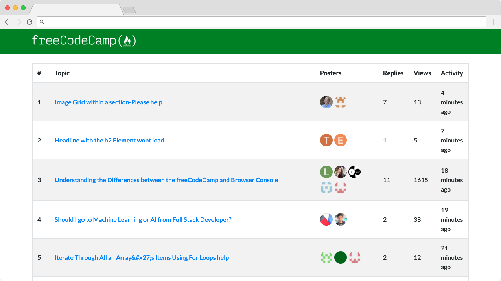

# FCC Leaderboard

[](https://github.com/vanillaSlice/the-mono/actions?query=workflow%3AFCC-Leaderboard+branch%3Amain)
[](https://codecov.io/gh/vanillaSlice/the-mono/tree/main/projects/fcc-leaderboard)
[](LICENSE)

A [FreeCodeCamp](https://www.freecodecamp.org/) leaderboard built using [React](https://reactjs.org/).
A deployed version can be viewed [here](https://fccleaderboard.mikelowe.xyz/).

## Screenshot



## Getting Started

### Prerequisites

* [npm](https://www.npmjs.com/)

### Installing Dependencies

From your terminal/command prompt run:

```
npm install
```

### Running

From your terminal/command prompt run:

```
npm start
```

Point your browser to [localhost:3000](http://localhost:3000).

## Technology Used

For those of you that are interested, the technology used in this project includes:

* [React](https://reactjs.org/)
* [Jest](https://jestjs.io/) (Testing)

## Useful Links

Resources useful for the completion of this project:

* [Create React App](https://github.com/facebook/create-react-app) (React starter kit)

## License

This project is licensed under the MIT License - see the [LICENSE](LICENSE) file for details.
