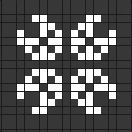
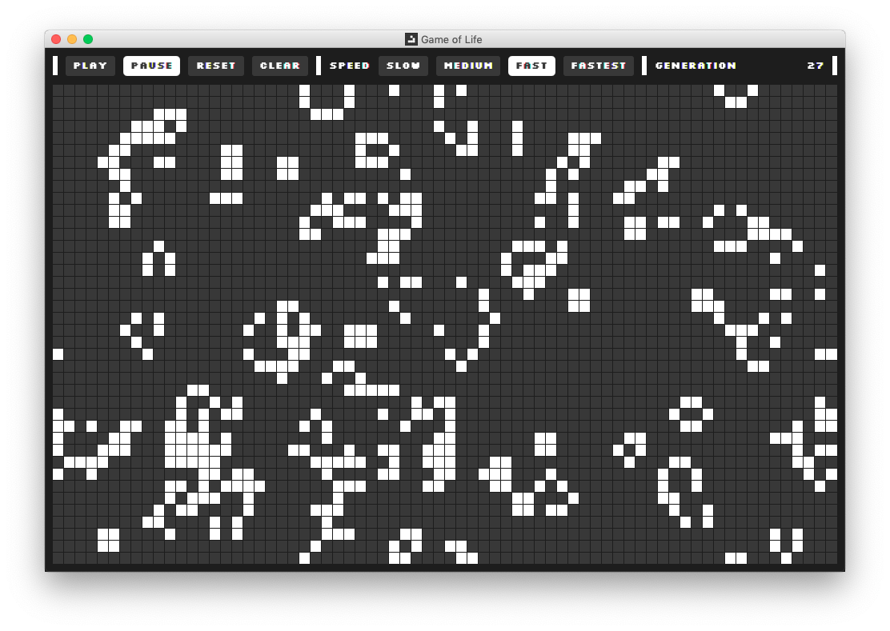

# Game of Life

[](https://github.com/vanillaSlice/the-mono/actions?query=workflow%3AGame-of-Life+branch%3Amain)
[](https://coveralls.io/github/vanillaSlice/GameOfLife?branch=master)
[](LICENSE)

*The Game of Life* is a cellular automaton devised by mathematician John Conway.

In the game there exists a grid of cells, each of which can be in one of two states, *alive* or *dead*.
Every cell has eight neighbours (adjacent cells) which it interacts with. After each step in the game, the following
rules apply:

1. Any live cell with fewer than two live neighbours dies, i.e. underpopulation.
2. Any live cell with two or three live neighbours lives on to the next generation.
3. Any live cell with more than three live neighbours dies, i.e. overpopulation.
4. Any dead cell with exactly three live neighbours becomes a live cell, i.e. reproduction.

An example of cell interaction:



See [Wikipedia](https://en.wikipedia.org/wiki/Conway's_Game_of_Life) for more information on *The Game of Life*.

## Screenshot



## Getting Started

### Prerequisites

* [Java 8](https://www.oracle.com/technetwork/java/javase/overview/java8-2100321.html)
* [Gradle](https://gradle.org) (optional)

### Building

1. Clone the project.
2. Navigate to the project directory in your terminal/command prompt.
3. If you have Gradle installed locally, run the Gradle Daemon:

    ```
    gradle clean buildFatJar
    ```

   If you don't have Gradle installed locally and are running on a Unix-like platform such as Linux or macOS, run:

    ```
    ./gradlew clean buildFatJar
    ```

   If you don't have Gradle installed locally and are running on Windows, run:

    ```
    gradlew clean buildFatJar
    ```

    This will create a jar file called `GameOfLife.jar` in `build/libs`.

### Running

To run the application double-click `GameOfLife.jar` or from your terminal/command prompt run:

```
java -jar GameOfLife.jar
```

## Technology Used

For those of you that are interested, the technology used in this project includes:

* [Java 8](https://www.oracle.com/technetwork/java/javase/overview/java8-2100321.html)
* [JavaFX](https://docs.oracle.com/javase/8/javase-clienttechnologies.htm) (for the GUI)
* [JUnit 5](https://junit.org/junit5/), [Mockito](https://site.mockito.org/) and
  [TestFX](https://github.com/TestFX/TestFX) (for testing)
* [Gradle](https://gradle.org) (for building and dependency management)

## Useful Links

Resources useful for the completion of this project:

* [The Game of Life on Wikipedia](https://en.wikipedia.org/wiki/Conway's_Game_of_Life)
* [Silkscreen](https://www.kottke.org/plus/type/silkscreen/index.html) (the font used in the GUI)

## License

This project is licensed under the MIT License - see the [LICENSE](LICENSE) file for details.
