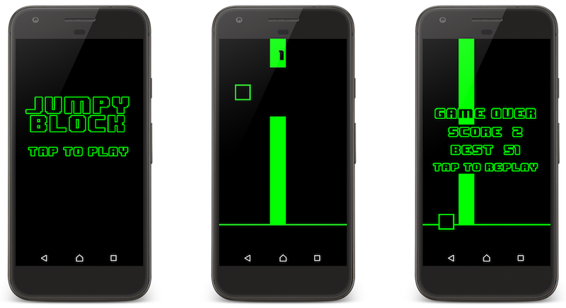

# Jumpy Block

[](https://github.com/vanillaSlice/the-mono/actions?query=workflow%3AJumpy%20Block+branch%3Amain)
[](LICENSE)


A Flappy Bird clone built using [libGDX](https://libgdx.badlogicgames.com/).

## Screenshot



## Getting Started

### Prerequisites

* [Java 6+](https://www.oracle.com/technetwork/java/javase/overview/java8-2100321.html)
* [Gradle](https://gradle.org) (optional)

### Running

#### Desktop

From your terminal/command prompt run:

```
./gradlew desktop:run
```

This compiles the core and desktop project, and runs the desktop starter.

#### Android

From your terminal/command prompt run:

```
./gradlew android:installDebug android:run
```

This task will create a debug APK of the application, install it on the first connected emulator or device and start
the main activity.

## Technology Used

For those of you that are interested, the technology used in this project includes:

* [libGDX](https://libgdx.badlogicgames.com/) (cross-platform game development framework)
* [Gradle](https://gradle.org) (for building and dependency management)

## Useful Links

Resources useful for the completion of this project:

* [Music](http://ericskiff.com/music/) (the track used in the game is A Night Of Dizzy Spells by Eric Skiff)
* [Font](http://www.dafont.com/8bit-wonder.font) (the font used in the game is 8-bit Wonder created by Joiro Hatagaya)

## License

This project is licensed under the MIT License - see the [LICENSE](LICENSE) file for details.
