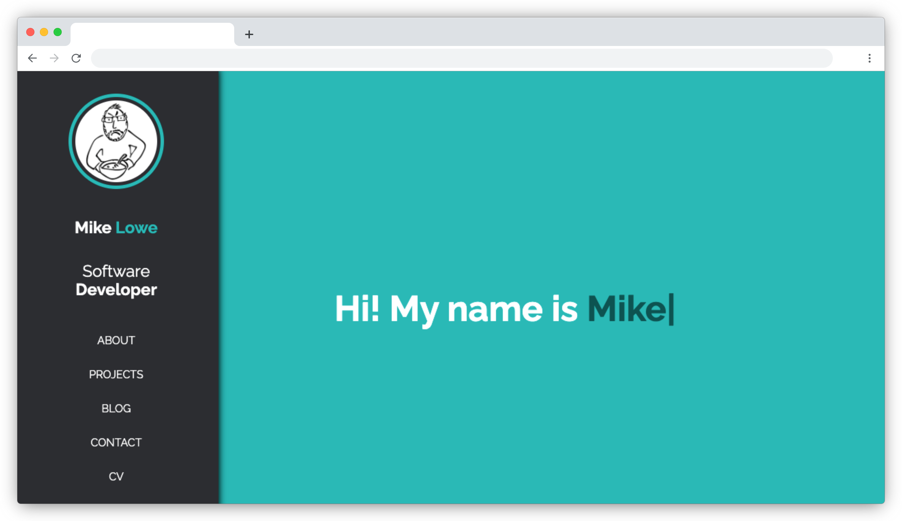

# Legacy One

[](https://github.com/vanillaSlice/the-mono/actions?query=workflow%3ALegacy-One+branch%3Amain)
[](LICENSE)

Source code for my legacy website which can be viewed [here](https://legacy-one.mikelowe.xyz/).

This project was bootstrapped with [Create React App](https://github.com/facebookincubator/create-react-app).

## Screenshot



## Installing dependencies
```
npm install
```

## Running locally
```
npm start
```

## Run tests
```
npm test
```

## License

This project is licensed under the MIT License - see the [LICENSE](LICENSE) file for details.
