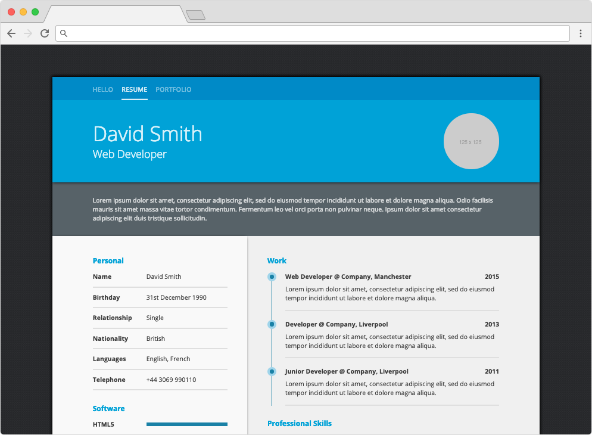

# Resume Template

[](https://github.com/vanillaSlice/the-mono/actions?query=workflow%3AResume-Template+branch%3Amain)
[](LICENSE)

A clone of [this](https://creativemarket.com/ikonome/686585-Material-Resume-Blue/screenshots/#screenshot1) resume
template built in plain old HTML and CSS.
A deployed version can be viewed [here](https://resumetemplate.mikelowe.xyz/).

## Screenshot



## Getting Started

### Prerequisites

* [npm](https://www.npmjs.com/)

### Installing Dependencies

From your terminal/command prompt run:

```
npm install
```

### Running

From your terminal/command prompt run:

```
npm start
```

Point your browser to [localhost:1234](http://localhost:1234).

## Technology Used

For those of you that are interested, the technology used in this project includes:

* [npm](https://www.npmjs.com/) (package management)
* [Parcel](https://parceljs.org/) (application bundler)

## License

This project is licensed under the MIT License - see the [LICENSE](LICENSE) file for details.
