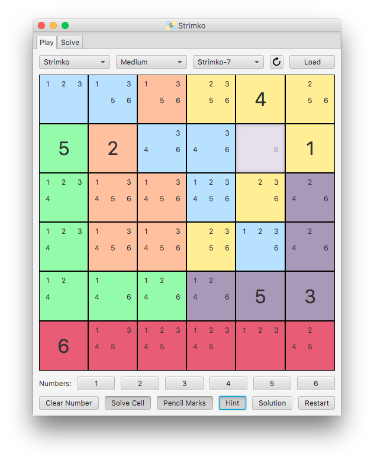

# Strimko

[](https://github.com/vanillaSlice/the-mono/actions?query=workflow%3AStrimko+branch%3Amain)
[](https://codecov.io/gh/vanillaSlice/the-mono/tree/main/projects/strimko)
[](LICENSE)

*Strimko* is a logic puzzle similar to *Sudoku*. The objective of the game, given a grid of size *n*, is to fill in the
grid with missing numbers such that each:

* row contains numbers 1 to *n*
* column contains numbers 1 to *n*
* stream contains numbers 1 to *n*

See [Strimko™](http://www.strimko.com/) for more details.

## Screenshot



## Features

There are two modes in the application:

1. Play Mode
2. Solve Mode

### Play Mode

* Play *Strimko* and *Sudoku* puzzles of easy, medium and hard difficulty.
* Show pencil marks as an aid to solve each puzzle.
* Show hints as an aid to solve each puzzle.
* Show the solution for each puzzle.

### Solve Mode

* Solve *Strimko* and *Sudoku* puzzles.
* Determine if a puzzle is solvable or has multiple solutions.
* Determine the difficulty of a puzzle.
* Save the puzzle which can then be played by the user.

## Getting Started

### Prerequisites

* Java 8
* Gradle (optional)

### Building

1. Clone the project
2. Navigate to the project directory in your terminal/command prompt
3. If you have Gradle installed locally, run the Gradle Daemon:

    ```
    gradle clean buildFatJar
    ```

   If you don't have Gradle installed locally and are running on a Unix-like platform such as Linux or Mac OS X, run:

    ```
    ./gradlew clean buildFatJar
    ```

   If you don't have Gradle installed locally and are running on Windows, run:

    ```
    gradlew clean buildFatJar
    ```

### Running

Once built, to run the application go to `build/libs` and double-click `Strimko.jar` or from your
terminal/command prompt run:

```
java -jar Strimko.jar
```

## Technology Used

For those of you that are interested, the technology used in this project includes:

* Java 8
* JavaFX (for the GUI)
* Guava (helpful Java library)
* JUnit, Mockito and TestFX (for unit testing)
* Gradle (for building and dependency management)

## Useful Links

Resources useful for the completion of this project:

* [Strimko™](http://www.strimko.com/)
* [Sudoku Solutions](http://www.sudoku-solutions.com/)
* [JavaFX](http://docs.oracle.com/javase/8/javase-clienttechnologies.htm)
* [Guava](https://github.com/google/guava)
* [Gradle](https://gradle.org)

## License

This project is licensed under the MIT License - see the [LICENSE](LICENSE) file for details.
