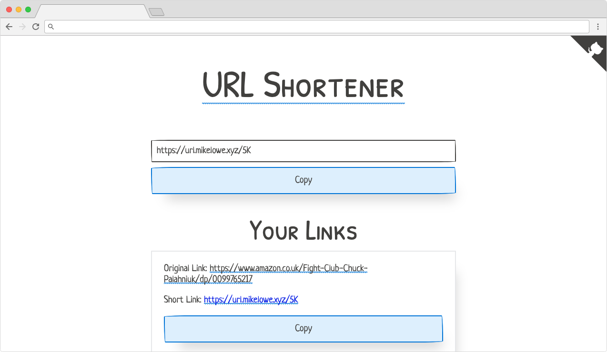

# URL Shortener

[](https://github.com/vanillaSlice/the-mono/actions?query=workflow%3AURL-Shortener+branch%3Amain)
[](https://codecov.io/gh/vanillaSlice/the-mono/tree/main/projects/URL%20Shortener)
[](LICENSE)

A simple URL shortener built with [Flask](http://flask.pocoo.org/) and [MongoDB](https://www.mongodb.com/).
A deployed version can be viewed [here](https://url.mikelowe.xyz/).

## Screenshot



## Getting Started

* [With Docker](#with-docker)
* [Without Docker](#without-docker)

### With Docker

#### Prerequisites

* [Docker](https://www.docker.com/)

#### Running

From your terminal/command prompt run:

```
docker-compose up
```

Then point your browser to [http://127.0.0.1:5000/](http://127.0.0.1:5000/).

### Without Docker

#### Installing Requirements

1. (Optional) Install [virtualenv](https://pypi.org/project/virtualenv/) and
[virtualenvwrapper](https://virtualenvwrapper.readthedocs.io/en/latest/) and create a new environment.
2. Run `pip install -r requirements.txt`.

#### Setting up MongoDB

You can either:

* Install MongoDB locally by going [here](https://www.mongodb.com/download-center#community).

or:

* Create a database in the cloud using [MongoDB Atlas](https://www.mongodb.com/cloud/atlas).

#### Configuration

The following properties can be configured:

| Name                    | Purpose                                                          | Default              |
| ----------------------- | ---------------------------------------------------------------- | -------------------- |
| `DEBUG`                 | If debug mode is enabled.                                        | `False`              |
| `ENV`                   | Environment the app is running in.                               | `production`         |
| `MONGODB_HOST`          | The MongoDB host name.                                           | `127.0.0.1`          |
| `SAFE_BROWSING_API_KEY` | The Safe Browsing API key to check malicious links.              | `None`               |
| `SECRET_KEY`            | A secret key used for security.                                  | `default secret key` |
| `SERVER_NAME`           | The host and port of the server.                                 | `127.0.0.1:5000`     |
| `SESSION_COOKIE_DOMAIN` | The domain match rule that the session cookie will be valid for. | `127.0.0.1:5000`     |
| `SSL`                   | If the domain has a valid SSL certificate.                       | `True`               |

To change these properties you can export them as environment variables or create a file `instance/config.py` (note
that any environment variables take precedence).

URI style connections are also supported for connecting to MongoDB, just supply the URI as `MONGODB_HOST` (note that
URI properties will take precedence).

If `SAFE_BROWSING_API_KEY` is set, then URLs will be checked to see if they are malicious. Get an API key by going
[here](https://developers.google.com/safe-browsing/v4).

#### Running

From your terminal/command prompt run:

```
./run.py
```

Then point your browser to [http://127.0.0.1:5000/](http://127.0.0.1:5000/).

## Technology Used

For those of you that are interested, the technology used in this project includes:

* [Python](https://www.python.org/)
* [Flask](http://flask.pocoo.org/) (Microframework)
* [MongoDB](https://www.mongodb.com/) and
[Flask-MongoEngine](http://docs.mongoengine.org/projects/flask-mongoengine/en/latest/) (Database)
* [pytest](https://docs.pytest.org/en/latest/) and [Mongomock](https://github.com/mongomock/mongomock) (Testing)
* [Docker](https://www.docker.com/)

## License

This project is licensed under the MIT License - see the [LICENSE](LICENSE) file for details.
