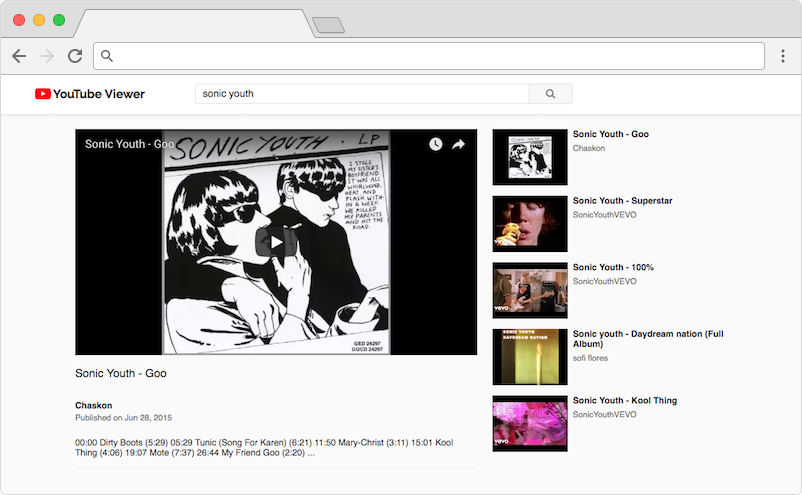

# YouTube Viewer

[](https://github.com/vanillaSlice/the-mono/actions?query=workflow%3AYouTube-Viewer+branch%3Amain)
[](https://codecov.io/gh/vanillaSlice/the-mono/tree/main/projects/youtube-viewer)
[](LICENSE)

A simple YouTube viewer built using [React](https://reactjs.org/).
A deployed version can be viewed [here](https://youtubeviewer.mikelowe.xyz/).

## Screenshot



## Getting Started

### Prerequisites

* [npm](https://www.npmjs.com/)

### YouTube API Key

This app requires an API key for the YouTube Data API. Go
[here](https://developers.google.com/youtube/v3/getting-started) to find out how to get one.
Create a copy of the file `.env.local-example` and call it `.env.local`.
Set the `REACT_APP_API_KEY` variable in this file to be your API key.

### Installing Dependencies

From your terminal/command prompt run:

```
npm install
```

### Running

From your terminal/command prompt run:

```
npm start
```

Point your browser to [localhost:3000](http://localhost:3000).

## Technology Used

For those of you that are interested, the technology used in this project includes:

* [React](https://reactjs.org/)
* [Jest](https://jestjs.io/) (Testing)

## Useful Links

Resources useful for the completion of this project:

* [Create React App](https://github.com/facebook/create-react-app) (React starter kit)
* [YouTube Data API](https://developers.google.com/youtube/v3/getting-started)

## License

This project is licensed under the MIT License - see the [LICENSE](LICENSE) file for details.
